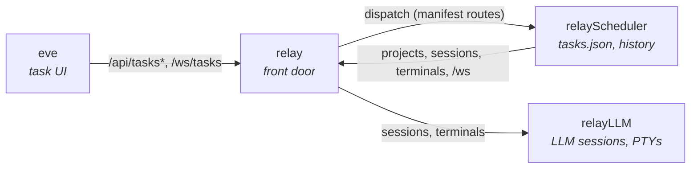

# relayScheduler

Runs tasks on a schedule for the Relay ecosystem. A task is either a **chat
prompt** sent to an LLM, or a **terminal command** launched from a PTY template.
relayScheduler decides *when* a task runs. relayLLM does the running, relay
routes the traffic, and eve is where you create tasks and read the results.

## How it fits together



- **eve → relayScheduler.** eve calls the task API and subscribes to
  `/ws/tasks` through relay. relayScheduler never talks to eve directly.
- **relay → relayScheduler.** relay spawns relayScheduler, which registers a
  manifest claiming `/api/tasks`, `/api/tasks/` and `/ws/tasks`. relay proxies
  those routes to the scheduler's Unix socket, swapping the caller's bearer for
  the scheduler's own token.
- **relayScheduler → relayLLM.** When a task fires, the scheduler calls relay's
  front door to look up the project and create a session or terminal. relay
  routes that to relayLLM. Tasks reference projects by id only; relay brokers
  the project-scoped token, so the scheduler never holds one.
- **Results → eve.** The scheduler broadcasts lifecycle events on `/ws/tasks`.
  Each event carries a `view` telling eve how to open the run: join the chat
  session, or open the terminal viewer.

## Task types

| | Chat (`"sessionType": "headless"`, the default) | Terminal (`"sessionType": "pty"`) |
|---|---|---|
| What runs | `prompt` is sent to a new headless LLM session in the project | A relayLLM terminal template (`templateId`) with `extraArgs` appended |
| Required | `prompt`, `model` | `templateId` |
| Optional | | `extraArgs`, `directory` (defaults to the project path) |
| Succeeds when | The turn completes | The process exits 0 |
| History records | Reply text, token and cost stats | Exit code, last 16 KB of terminal output |
| eve opens the run as | An interactive session you can keep chatting in | A read-only terminal: live while running, replayed from the log after |

Every task also needs `name`, `projectId` and `schedule`. `maxDurationSeconds`
caps a run for either type; the default is 30 minutes.

Headless chat sessions run without interactive permission prompts. relayLLM
handles that, because the scheduler creates them with
`settings: {"headless": true}`. Terminal templates live in relayLLM's
`settings.json` (`pty` section). The built-ins are `claude-code`, `opencode`
and `shell`, so `{"templateId": "shell", "extraArgs": ["-c", "npm test"]}`
runs `npm test`.

### Examples

```json
{
  "name": "Morning digest",
  "projectId": "3f2a…",
  "prompt": "Summarize yesterday's commits and open PRs.",
  "model": "sonnet",
  "enabled": true,
  "catchUp": true,
  "schedule": {"type": "daily", "time": "08:30"}
}
```

```json
{
  "name": "Nightly tests",
  "projectId": "3f2a…",
  "sessionType": "pty",
  "templateId": "shell",
  "extraArgs": ["-c", "npm test"],
  "maxDurationSeconds": 1200,
  "enabled": true,
  "schedule": {"type": "cron", "expression": "0 2 * * *"}
}
```

## Schedules

| Type | Fields | Example | Runs |
|---|---|---|---|
| `daily` | `time` (HH:MM) | `{"type":"daily","time":"09:00"}` | Every day at 09:00 |
| `hourly` | `minute` (0–59) | `{"type":"hourly","minute":30}` | Every hour at :30 |
| `interval` | `minutes` (> 0) | `{"type":"interval","minutes":15}` | 15 minutes after the task is loaded or saved, then 15 minutes after each run finishes |
| `weekly` | `day`, `time` | `{"type":"weekly","day":"monday","time":"09:00"}` | Mondays at 09:00 |
| `cron` | `expression` | `{"type":"cron","expression":"30 14 * * *"}` | Daily at 14:30 |
| `once` | `at` (RFC 3339) | `{"type":"once","at":"2026-10-01T09:00:00-07:00"}` | Once, then the task disables itself |
| `on_demand` | — | `{"type":"on_demand"}` | Only when triggered via `POST /api/tasks/{id}/run` |

- Wall-clock times use the time zone of the machine running the scheduler.
- `cron` is a small subset: `M H * * *` (daily) or `M * * * *` (hourly). Steps,
  ranges, lists and day or month fields are rejected; use `weekly`, `daily` or
  `interval` instead.
- A `once` time must be in the future when the task is created or updated.
- Invalid schedules are rejected with a 400 on create and update.

## When runs happen

- The scheduler checks for due tasks every 30 seconds against the wall clock,
  so runs survive macOS sleep.
- **Missed runs.** A run more than 10 minutes late (the machine slept, or the
  scheduler was down) is skipped unless the task has `"catchUp": true`. A
  skipped `once` task is disabled.
- **No overlap.** A task never runs twice at once. A scheduled run that comes
  due mid-run is skipped, and a manual run gets `409 Conflict`.
- **One live run per task.** Starting a run deletes the previous run's chat
  session or closes its terminal, so the last run stays open in eve until the
  next one starts.
- **Timeouts.** A chat run past `maxDurationSeconds` is stopped and recorded as
  `timeout`. A terminal run past it is killed.
- **No model.** A chat task stored with a blank `model` (from before the API
  required one) is not given a fallback. Each run fails as `task_error` with
  the reason in history, until the task is edited to name a model.
- If the scheduler dies mid-run, the task's last status is reset to `error` on
  startup. That run has no history entry.

## Run history

`GET /api/tasks/{id}/history` returns the newest 100 runs, newest first:

| Field | Meaning |
|---|---|
| `status` | `running`, `success`, `error` or `timeout` |
| `startedAt`, `completedAt` | RFC 3339 UTC |
| `sessionId` / `terminalId` | The chat session or terminal the run used |
| `response` | Chat reply text, or the tail of terminal output |
| `error` | Why the run failed |
| `stats` | Chat only: `inputTokens`, `outputTokens`, cache tokens, `costUsd` |
| `exitCode` | Terminal only. Negative codes are scheduler-side: `-1` session lost, `-2` timeout, `-3` terminal couldn't be created |

## API

Served over the scheduler's Unix socket. Every request needs
`Authorization: Bearer <token>`.

```
GET    /api/tasks                        list tasks (optional ?projectId=)
POST   /api/tasks                        create a task
GET    /api/tasks/{id}                   get a task
PUT    /api/tasks/{id}                   replace a task definition (run state is kept)
DELETE /api/tasks/{id}                   delete a task
GET    /api/tasks/{id}/history           run history
POST   /api/tasks/{id}/run               run now
DELETE /api/tasks/by-project/{projectId} delete every task in a project
WS     /ws/tasks                         lifecycle events
```

Stored tasks include a derived `view`:
`{"kind": "interactive" | "readonly", "runId": "...", "hasLastRun": true}`.
`interactive` is a chat session and `readonly` is a terminal.

### Events on `/ws/tasks`

| Type | When | Extra fields |
|---|---|---|
| `task_status` | Once, on connect | `running`: tasks currently executing |
| `task_started` | A session or terminal was created | — |
| `task_completed` | The run succeeded | `status`, plus `exitCode` for terminals |
| `task_error` | The run failed or timed out | `error`, plus `exitCode` for terminals. `status` is present once a session or terminal was created |

Lifecycle events carry `taskId`, `projectId`, `taskName` and `view`, where
`view.runId` is the run being announced.

## Running

### Under Relay

```bash
./build.sh
```

This builds and codesigns the binary, then registers it with Relay as an
autostart service with the `frontend` and `manifest` capabilities:

```bash
relay service register --name "Relay Scheduler" --command "$(pwd)/relayscheduler" \
  --capability frontend --capability manifest --autostart
```

No flags are needed, and relay puts no credential in the environment. It
passes a one-time launch secret on fd 3 (`RELAY_LAUNCH_FD=3`), which the
scheduler reads and presents in a `Hello` on `RELAY_BRIDGE_SOCKET` before doing
anything else. From then on relay recognises the process itself: manifest
registration carries no token and front-door calls on `RELAY_FRONTEND_SOCKET`
carry no `Authorization` header. If the secret or the Hello fails, or relay
supplied no `RELAY_FRONTEND_SOCKET` (the service lacks the `frontend`
capability), the scheduler exits rather than running without relay. See relay's
`docs/launch-identity.md`.

### Standalone

```bash
go build .
./relayscheduler --relay-socket /path/to/relay-frontend.sock --relay-token "$RELAY_FRONTEND_TOKEN" --token "$SCHEDULER_TOKEN"
```

| Flag | Env var | Default | Purpose |
|---|---|---|---|
| `--socket` | `RELAY_SCHEDULER_SOCKET` | `{data-dir}/relayscheduler.sock` | Socket the API listens on |
| `--token` | `RELAY_SCHEDULER_TOKEN` | random, never logged | Bearer required by the API |
| `--data-dir` | `RELAY_SCHEDULER_DATA` | `~/Library/Application Support/relayScheduler` (macOS), `~/.config/relayScheduler` (Linux) | Tasks and history |
| `--relay-socket` | `RELAY_FRONTEND_SOCKET` | — | relay front-door socket |
| `--relay-token` | `RELAY_FRONTEND_TOKEN` | — | relay front-door bearer (standalone only; ignored under relay) |
| `--relay-url` | `RELAY_FRONTEND_URL` | `http://localhost:3000` | relay over TCP, when `--relay-socket` is empty |

Set `--token` yourself when running standalone; an auto-generated token is
never printed, so you couldn't call the API.

```bash
curl --unix-socket ~/Library/Application\ Support/relayScheduler/relayscheduler.sock \
  -H "Authorization: Bearer $SCHEDULER_TOKEN" http://scheduler/api/tasks
```

### Data

- `tasks.json`: every task definition, plus each task's last run state.
- `task-logs/{projectId}-{taskId}.json`: run history, capped at 100 entries.

## Ecosystem

- **[Relay](https://github.com/barelyworkingcode/relay)**: orchestrator and
  front door. Spawns relayScheduler, routes its API, and brokers project tokens.
- **[relayLLM](https://github.com/barelyworkingcode/relayLLM)**: runs the LLM
  sessions and terminals that tasks execute in.
- **[eve](https://github.com/barelyworkingcode/eve)**: web UI for creating
  tasks, running them, and opening their results.

## License

[MIT](./LICENSE)
